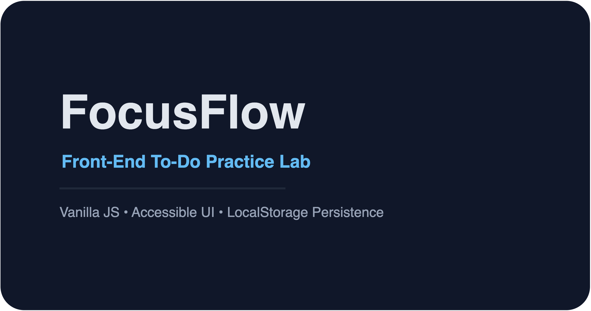

# FocusFlow – Front-End To-Do Practice Lab

FocusFlow is a recruiter-friendly to-do experience designed to spotlight HTML, CSS, and vanilla JavaScript craftsmanship. The repo started as raw markup drills and now ships a production-ready interface with deployment automation.



> ✨ Built to showcase front-end iteration: deliberate UX decisions, clean architecture, and documentation that helps reviewers follow the story.

---

## 🔍 Key Features

- **Modern UX:** responsive glassmorphism design, theme toggle with system preference detection, keyboard shortcuts (`⌘/Ctrl + K` to search).
- **Productivity tooling:** filters, live search, overdue highlighting, completion analytics, and quick status messaging.
- **Data ownership:** tasks persist in `localStorage`, can be exported/imported as JSON, and sync across tabs via the Storage API.
- **Extensible foundation:** modular vanilla JS ready for API integration, componentisation, or framework rewrites.

---

## 🧪 Try It Locally

### Option A — Static preview

1. Open `modern-todo-app/index.html` in any modern browser.
2. Add tasks, toggle themes, and explore the search, filters, and edit dialog.
3. Export tasks as JSON, refresh the page, and import them back to validate persistence.

### Option B — Docker container

```bash
cd modern-todo-app
docker build -t focusflow .
docker run -p 8080:80 focusflow
```

Visit `http://localhost:8080` to interact with the app served via Nginx.

> Tip: Capture a short GIF of the workflow (add → filter → edit → export) to embed in your portfolio.

---

## 🗄️ Repository Structure

```
FrontEnd_ToDo_practice/
├── README.md
├── modern-todo-app/
│   ├── index.html
│   ├── Dockerfile                # Nginx container for the static build
│   ├── .dockerignore
│   └── assets/
│       ├── app.js
│       ├── styles.css
│       └── focusflow-banner.png/svg
├── .github/workflows/deploy.yml  # GitHub Pages automation
├── docs/
│   ├── case-study.md
│   └── components/
│       ├── task-list.md
│       └── theme-toggle.md
└── archive/
    ├── Javascriptcuminnin/       # Early JS drills (DOM manipulation, events)
    ├── StaticToDowithStylE/      # CSS and layout experiments
    └── StaticTodo/               # Foundational HTML markup exercises
```

The `archive/` directory preserves the learning journey from raw HTML to a polished app—useful when discussing growth with recruiters.

---

## 🚀 Deployment & CI

- GitHub Actions workflow (`.github/workflows/deploy.yml`) publishes the `modern-todo-app` folder to GitHub Pages.
- Dockerfile in the same directory serves the static bundle via Nginx for local demos or container platforms.
- `.dockerignore` keeps the image lean by excluding Git metadata and temporary files.

## ✅ Automated Testing

- End-to-end coverage powered by Playwright (`npm test`) lives in `tests/` with configuration in `playwright.config.ts`.
- Tests boot a static server via `http-server`, exercise the key UX flows (add/edit/complete/export, theme toggle), and capture downloads.
- Run locally with:

  ```bash
  npm install
  npx playwright install
  npm test
  ```

- GitHub Actions workflow (`.github/workflows/test.yml`) executes the same suite on every push and pull request so regressions surface immediately.

## 📈 Roadmap Ideas

- Wire tasks to Supabase/Firebase for real-time sync and authentication.
- Export completed items as Markdown for use in case studies or stand-up notes.
- Add Playwright smoke tests and run them in CI.
- Deploy to GitHub Pages (already automated) and capture analytics with Plausible.

---

## 🤝 About

Crafted by **Prashant Bhardwaj** to demonstrate front-end craftsmanship. Recruiters can dive straight into `modern-todo-app/` for the polished experience, then explore `docs/` and `archive/` to trace the learning progression.
